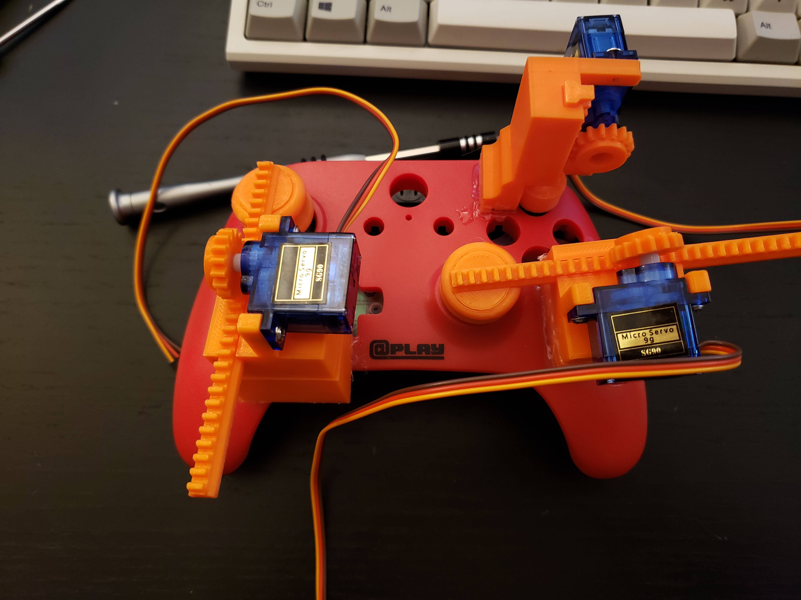

# console agent environment 
> over-engineered controller hardware environment + 3d printed rig

### Please do not use this in live games- this repo should be used for educational purposes only. 

## Build Requirements
- *RaspberryPi 4 Model B (or greater)
- *3D Printer
- *Spare console controller
- *x2 SG90 Micro Server Motors
- *PCA9685 Motor Controller
- [USB Video Capture Card](https://www.amazon.com/gp/product/B08LPT3T12/ref=ppx_yo_dt_b_asin_title_o01_s00?ie=UTF8&psc=1)
- Assortment of cables 

## Dependencies
- python >= 3.8
- sklearn

## Build Steps
1. Print the required parts on your 3d printer
2. Clone this repo on your raspberry pi
3. Ensure python3.8 or greater is installed on your machine
4. Install the project dependencies
5. Run the code with `python main.py` in the `/src` directory.
6. Profit

## 3D Models
I need to clean these up first, then I will link them on here
